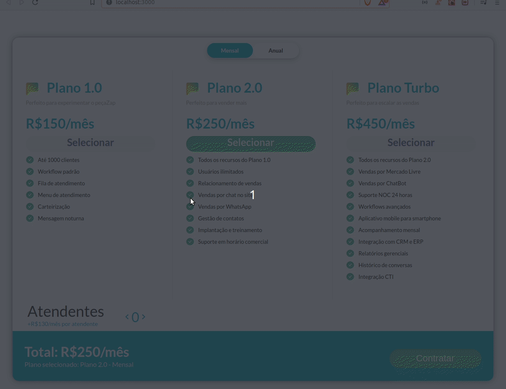

# Desafio_Vulcanet

<p align="center">

</p>

## Passo a passo

Com Yarn
```
$ git clone https://github.com/MarcusMartins38/Desafio_Vulcanet.git
$ cd Desafio_Vulcanet
$ yarn
$ yarn start
```
Com Npm

```
$ git clone https://github.com/MarcusMartins38/Desafio_Vulcanet.git
$ cd Desafio_Vulcanet
$ npm install
$ npm start
```
